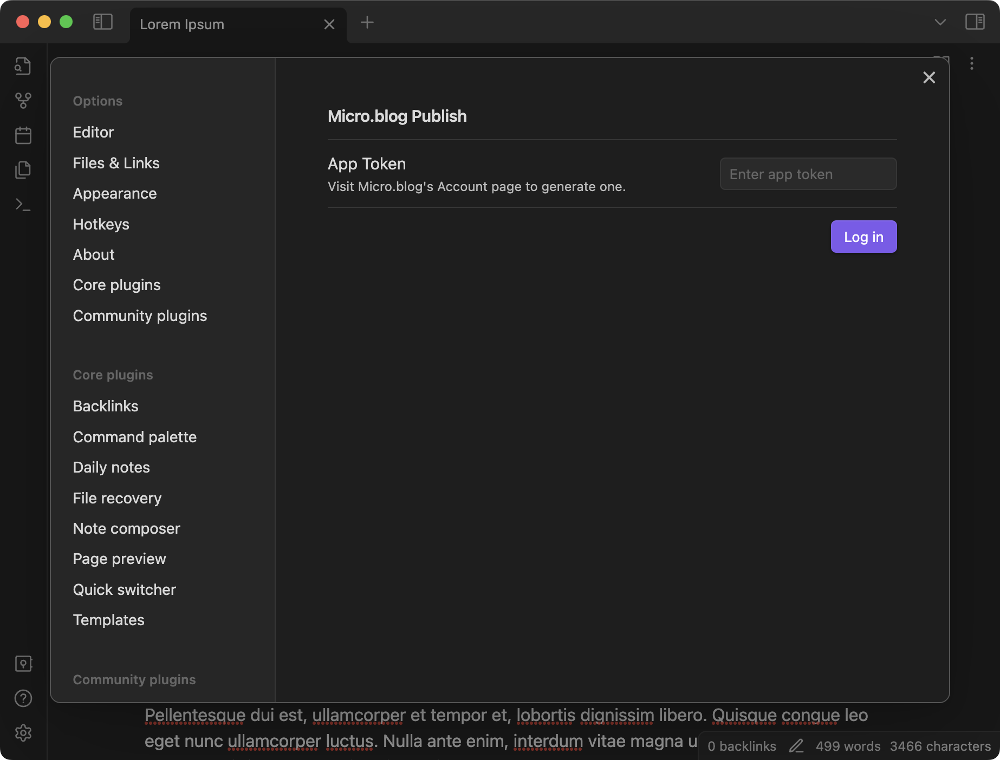
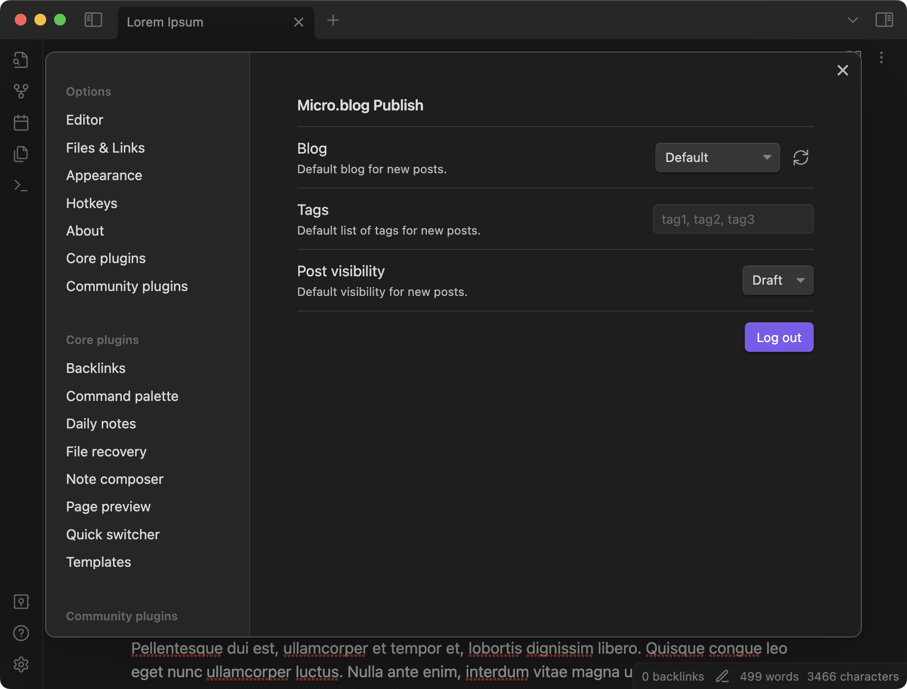
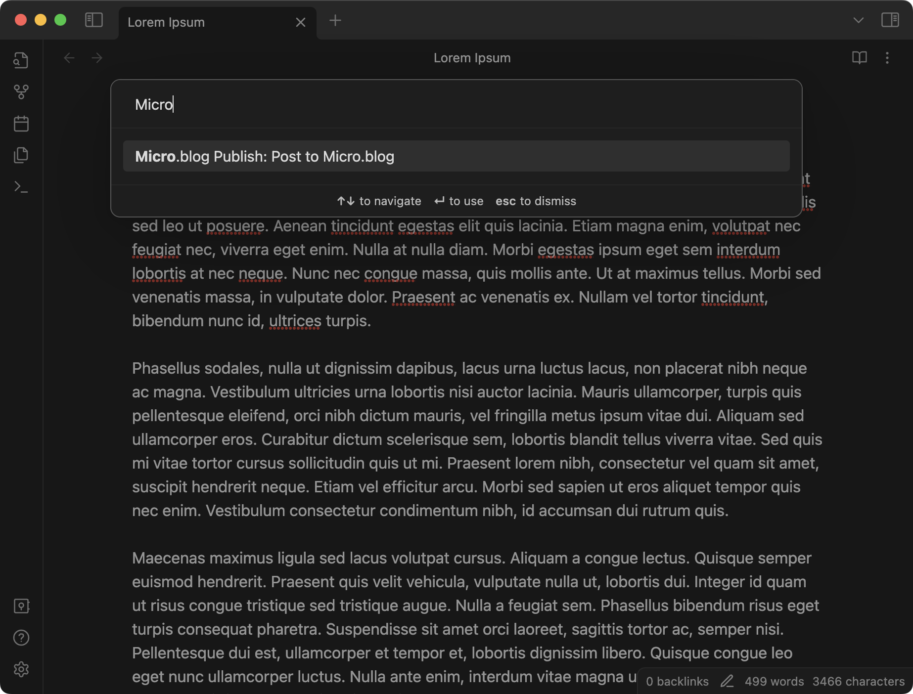
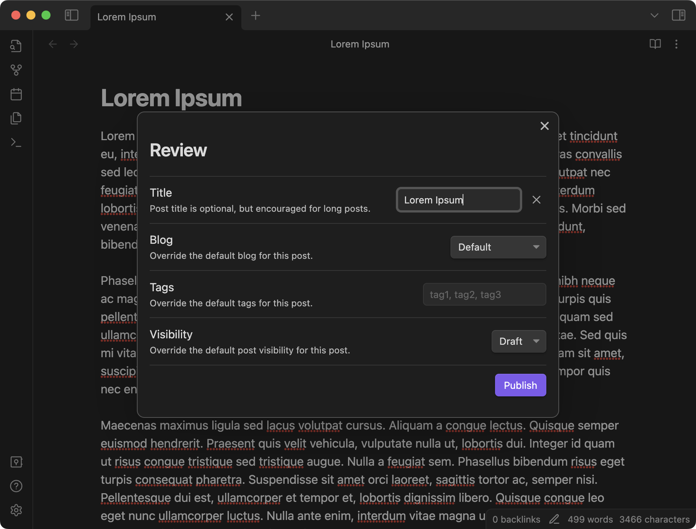
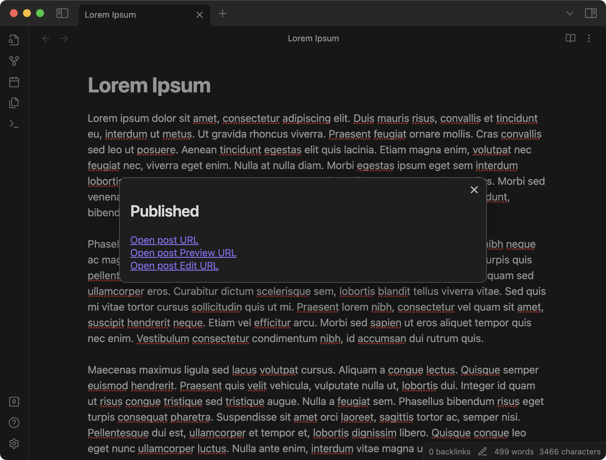

# Micro.blog Publish for Obsidian

Micro.blog Publish for [Obsidian](https://obsidian.md/) is a community maintained plugin to publish notes to a [Micro.blog](https://micro.blog/) blog.

## Installing

This plugin will be available via *Community Plugins* soon.

## Screenshots

### Preferences

From the preferences window it is possible to log in into Micro.blog using an App Token, which can be generated [here](https://micro.blog/account/apps).



Once logged in, the plugin allows to set default values for tags, post visibility, and default blog (in case the user has more than one hosted blog). These default values will be used when posting to Micro.blog.



### Command

Micro.blog Publish is triggered using Obsidian's command palette.



### Publish

Before publishing, it's possible to edit the title, override default values, and/or select a different blog to post to.



After publishing, a confirmation window with the post links is presented.



## Building from source

Clone this repository inside the Obsidian Vault:

```
$ cd .obsidian/plugins/
$ git clone https://github.com/otaviocc/obsidian-microblog
```

Resolve the plugin dependencies and build it:

```
$ cd obsidian-microblog
$ npm i
$ npm run build
```

Restart Obsidian and enable the plugin from *Community Plugins* in Preferences.

## Contributing

1. Fork this repository and follow the steps from the previous section using the forked repository instead
2. Create a feature branch for the changes
3. Commit the changes and push them to the forked repository
4. Submit a pull request

## Disclaimer

This project is neither affiliated with Micro.blog nor Obsidian. This is a community maintained plugin.