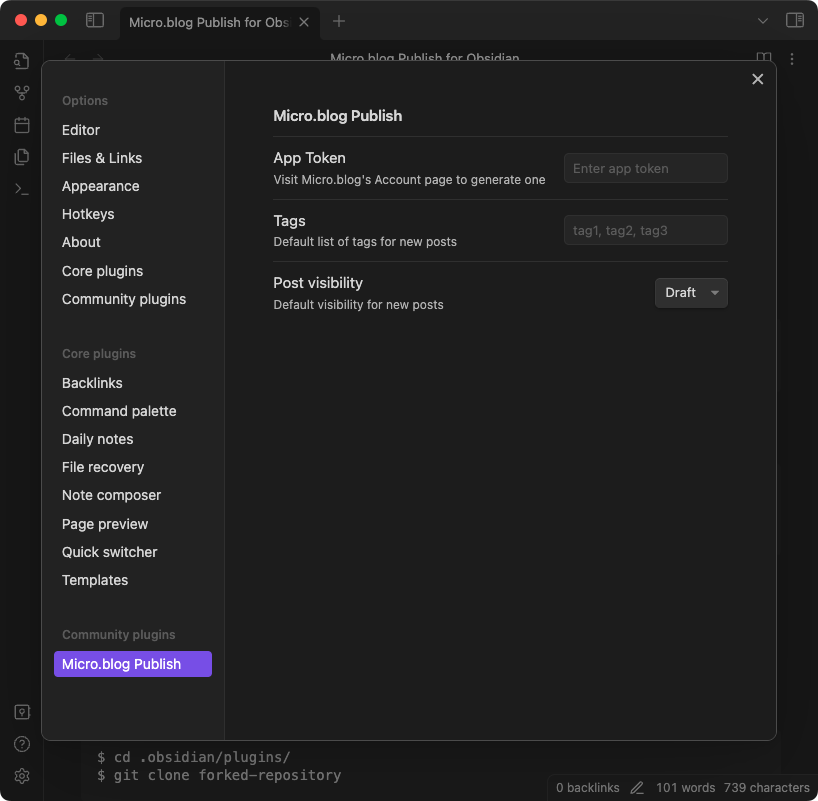
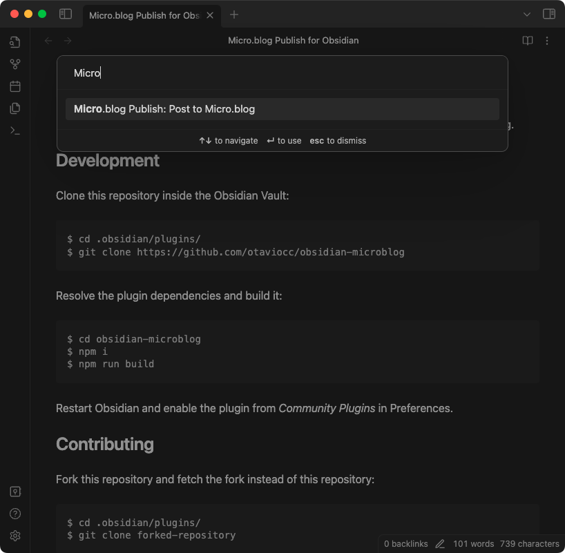
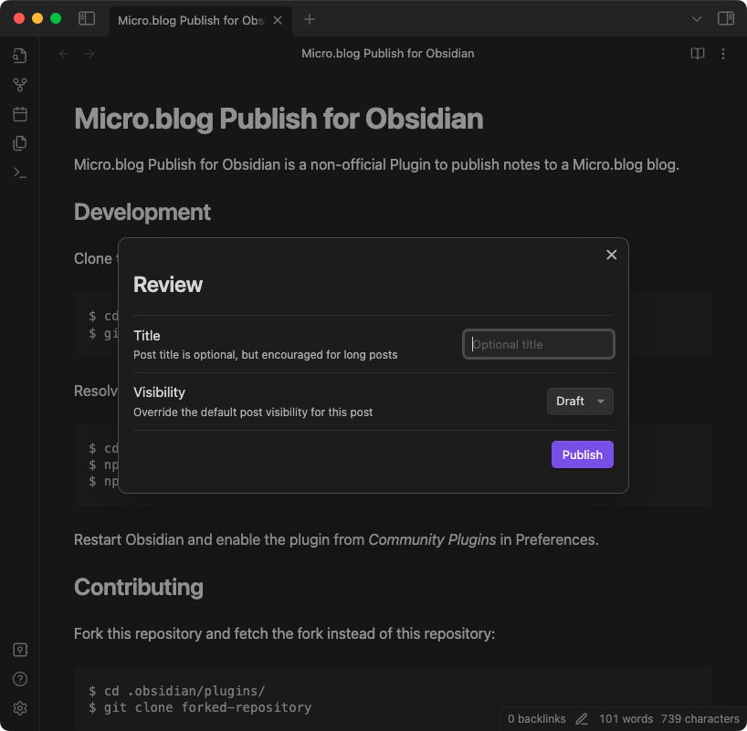

# Micro.blog Publish for Obsidian

[Micro.blog](https://micro.blog/) Publish for [Obsidian](https://obsidian.md/) is a community maintained plugin to publish notes to a Micro.blog blog.

## Installing

This plugin will be available via *Community Plugins* soon.

## Screenshots

### Preferences

In preferences it's possible to set the application token, required to post on Micro.blog, default tags, and default post visibility.



### Command

Publishing can be triggered using Obsidian's command palette.



### Publish

Before publishing, it's possible to add a title to the post and override the post visiblity.



## Development

Clone this repository inside the Obsidian Vault:

```
$ cd .obsidian/plugins/
$ git clone https://github.com/otaviocc/obsidian-microblog
```

Resolve the plugin dependencies and build it:

```
$ cd obsidian-microblog
$ npm i
$ npm run build
```

Restart Obsidian and enable the plugin from *Community Plugins* in Preferences.

## Contributing

Fork this repository and fetch the fork instead of this repository:

```
$ cd .obsidian/plugins/
$ git clone forked-repository
```

Create a branch for the changes:

```
$ git switch -c feature/feature-name
```

Commit the changes into the feature branch, and submit a Pull Request.

## Disclaimer

This project neither affiliated with Micro.blog nor Obsidian. This is a community maintained plugin.